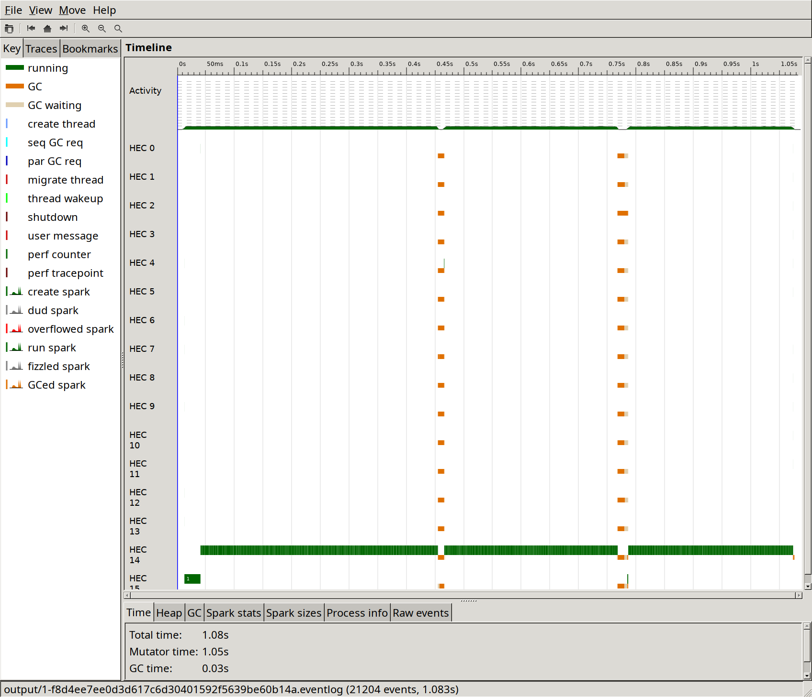
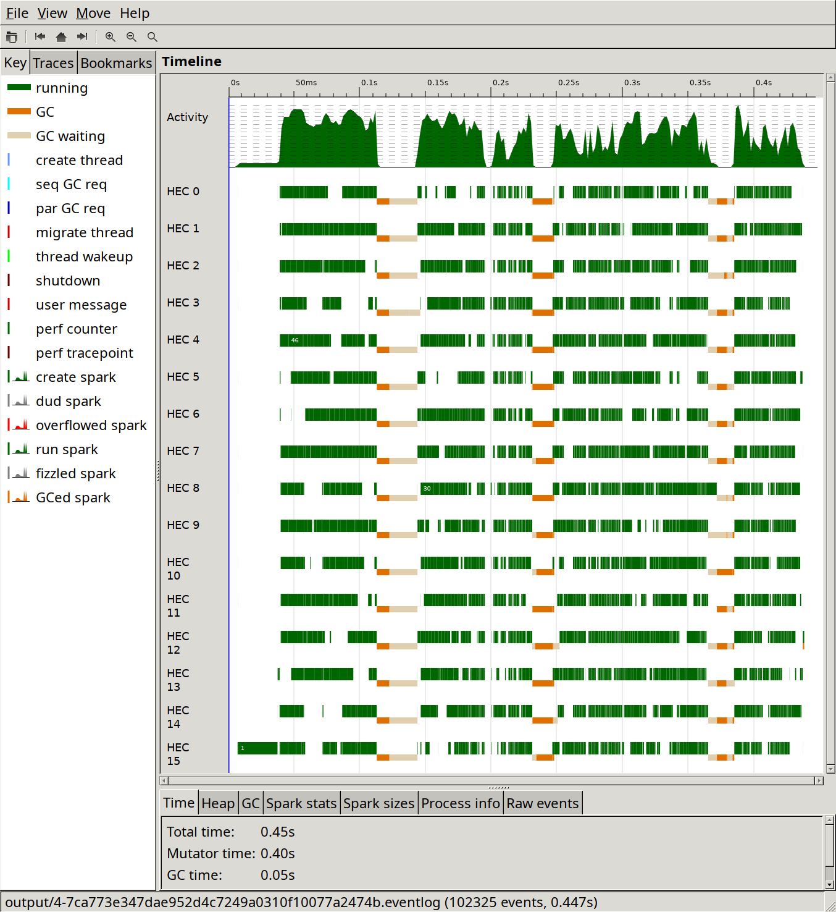
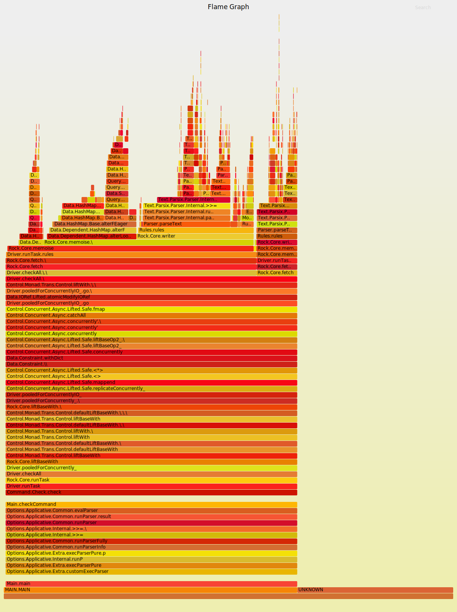
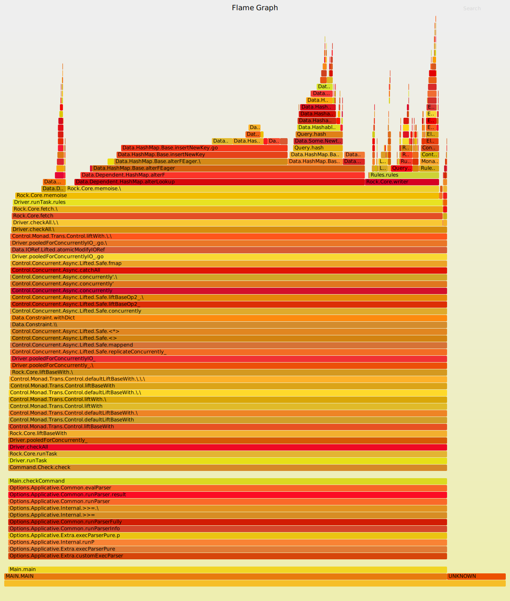

## Background

I'm working on a reimplementation of [Sixten](https://github.com/ollef/sixten),
a dependently typed programming language that supports unboxed data. The
reimplementation currently lives in a separate repository, and is called
[Sixty](https://github.com/ollef/sixty), though the intention is that it
should replace Sixten eventually.  The main reason for reimplementing it was to
try out some implementation techniques to make the type checker faster,
inspired by András Kovács' [smalltt](https://github.com/AndrasKovacs/smalltt).

In this post I'd like to show some optimisations that I did to Sixty, though
I'm going to focus on the parts of the compiler that are _not_ the type checker,
as it's already quite fast.

The goal of the post is both to show what I'm working on and also to show some
of my workflow when profiling and optimising Haskell code.

## A benchmark

I was curious to see how Sixty, the new Sixten compiler, would handle large
programs.  The problem is that no one has ever written a large program in
Sixten so far.

As a substitute, I added a command to Sixty to generate nonsense programs of a
given size. The programs that we'll be using in this post consist of 100
modules, with just over 10 000 lines of code in total, that all look like
this:

```haskell
module Module60 exposing (..)

import Module9
import Module24
import Module35
import Module16
import Module46
import Module37
import Module50
import Module47
import Module46
import Module3

f1 : Type
f1 = Module46.f10 -> Module46.f20

f2 : Type
f2 = Module50.f24 -> Module47.f13

[...]

f30 : Type
f30 = Module37.f4 -> Module24.f24
```

Each module is about 100 lines of code, of which a third or so are newlines,
and has thirty definitions that refer to definitions from some of the other
modules.  The definitions are simple enough to be type checked very quickly, so
the benchmark will make us focus our attention on parts of the compiler other
than the type checker.

## Profiling

I use three main tools to try to identify bottlenecks and other things to improve:

* [bench](http://www.haskellforall.com/2016/05/a-command-line-benchmark-tool.html)
    is a replacement for the Unix `time` command that I use to get more reliable
    timings, which is especially useful for comparing the before and after time of
    some change.
* GHC's built-in profiling support, which gives us a detailed breakdown of where
  time is spent when running the program.

  When using Stack, we can build with profiling by issuing:

  ```
  stack install --profile
  ```

  Then we can run the program with profiling enabled:

  ```
  sixty check +RTS -p
  ```

  This produces a file `sixty.prof` that contains the profiling information.

  I also really like to use [ghc-prof-flamegraph](https://github.com/fpco/ghc-prof-flamegraph) to turn the profiling output into a flamegraph:

  ```
  ghc-prof-flamegraph sixty.prof
  ```

* [Threadscope](https://wiki.haskell.org/ThreadScope) is a visual tool for debugging
    the parallelism in a Haskell program. It also shows when the garbage collector runs,
    so can be used when tuning garbage collector parameters.

## Baseline and initial profiling

This baseline used in this post starts on [this
commit](https://github.com/ollef/sixty/tree/29094e006d4c88f51d744b0fd26f3e2e18af3ce0).

At this point we get the following time to run `sixty check` in the 100 module project on my machine:

|          | Time    |
|----------|--------:|
| Baseline | 1.30 s  |

Here's a flamegraph of the profiling output at this point:

[](../images/optimising-sixty/0-29094e006d4c88f51d744b0fd26f3e2e18af3ce0.svg)

Two things stick out to me in the flamegraph:

* Parsing takes about 45 % of the time.
* Operations on [`Data.Dependent.Map`](https://hackage.haskell.org/package/dependent-map) take about 15 % of the time, and a large part of that is calls to `Query.gcompare`.

Here's what it looks like in ThreadScope:

[](../images/optimising-sixty/0-29094e006d4c88f51d744b0fd26f3e2e18af3ce0-threadscope.png)

Here's a more zoomed in ThreadScope picture:

[](../images/optimising-sixty/0-29094e006d4c88f51d744b0fd26f3e2e18af3ce0-threadscope-detail.png)

I note the following in the ThreadScope output:

* One core is doing almost all the work, with other cores occasionally performing very short tasks.
* Garbage collection runs extremely often and takes just over 20 % of the time.

## Optimisation 1: Better RTS flags

The result of this change is this:

|           | Time    | Delta |
|-----------|--------:|------:|
| Baseline  | 1.30 s  |       |
| RTS flags | 1.08 s  | -17 % |

[](../images/optimising-sixty/1-f8d4ee7ee0d3d617c6d30401592f5639be60b14a-threadscope.png)

## Optimisation 2: Using `IORef`s instead of `MVar`s

|           | Time    | Delta |
|-----------|--------:|------:|
| Baseline  | 1.30 s  |       |
| RTS flags | 1.08 s  | -17 % |
| `IORef`   | 0.613 s | -43 % |

[comment]: <> ([](../images/optimising-sixty/1-f8d4ee7ee0d3d617c6d30401592f5639be60b14a.svg))
[comment]: <> ([](../images/optimising-sixty/2-54b87689f345173dbed3510a396641cd8c5e43f2.svg))

[](../images/optimising-sixty/2-54b87689f345173dbed3510a396641cd8c5e43f2-threadscope.png)

## Optimisation 3: Manual query parallelisation

|                          | Time    | Delta |
|--------------------------|--------:|------:|
| Baseline                 | 1.30 s  |       |
| RTS flags                | 1.08 s  | -17 % |
| `IORef`                  | 0.613 s | -43 % |
| Manual parallelisation   | 0.451 s | -26 % |

[](../images/optimising-sixty/4-7ca773e347dae952d4c7249a0310f10077a2474b-threadscope.png)

## Optimisation 4: Parser lookahead

|                          | Time    | Delta |
|--------------------------|--------:|------:|
| Baseline                 | 1.30 s  |       |
| RTS flags                | 1.08 s  | -17 % |
| `IORef`                  | 0.613 s | -43 % |
| Manual parallelisation   | 0.451 s | -26 % |
| Parser lookahead         | 0.442 s |  -2 % |

## Optimisation 5: Dependent hashmap

|                          | Time    | Delta |
|--------------------------|--------:|------:|
| Baseline                 | 1.30 s  |       |
| RTS flags                | 1.08 s  | -17 % |
| `IORef`                  | 0.613 s | -43 % |
| Manual parallelisation   | 0.451 s | -26 % |
| Parser lookahead         | 0.442 s |  -2 % |
| Dependent hashmap        | 0.257 s | -42 % |

[](../images/optimising-sixty/5-8ea6700415f1c46fb300571382ef438ae6082e8e.svg)
[](../images/optimising-sixty/6-722533c5d71871ca1aa6235fe79a53f33da99c36.svg)

## Optimisation 6: `ReaderT`-based Rock library

|                          | Time    | Delta |
|--------------------------|--------:|------:|
| Baseline                 | 1.30 s  |       |
| RTS flags                | 1.08 s  | -17 % |
| `IORef`                  | 0.613 s | -43 % |
| Manual parallelisation   | 0.451 s | -26 % |
| Parser lookahead         | 0.442 s |  -2 % |
| Dependent hashmap        | 0.257 s | -42 % |
| `ReaderT` in Rock        | 0.245 s |  -5 % |

[](../images/optimising-sixty/7-048d2cec50e9994a0b159a2383580e3df5dd2a7e.svg)

## Optimisation 7: Separate lexer

|                          | Time    | Delta |
|--------------------------|--------:|------:|
| Baseline                 | 1.30 s  |       |
| RTS flags                | 1.08 s  | -17 % |
| `IORef`                  | 0.613 s | -43 % |
| Manual parallelisation   | 0.451 s | -26 % |
| Parser lookahead         | 0.442 s |  -2 % |
| Dependent hashmap        | 0.257 s | -42 % |
| `ReaderT` in Rock        | 0.245 s |  -5 % |
| Separate lexer           | 0.154 s | -37 % |

[](../images/optimising-sixty/8-11c46c5b03f26a66347d5f387bd4cdfd5f6de4a2.svg)

## Optimisation 8: Faster hashing

|                          | Time    | Delta |
|--------------------------|--------:|------:|
| Baseline                 | 1.30 s  |       |
| RTS flags                | 1.08 s  | -17 % |
| `IORef`                  | 0.613 s | -43 % |
| Manual parallelisation   | 0.451 s | -26 % |
| Parser lookahead         | 0.442 s |  -2 % |
| Dependent hashmap        | 0.257 s | -42 % |
| `ReaderT` in Rock        | 0.245 s |  -5 % |
| Separate lexer           | 0.154 s | -37 % |
| Faster hashing           | 0.146 s |  -5 % |

[](../images/optimising-sixty/9-d5bad6f606450d0a2c8926072e7b4845d982b81f.svg)
[](../images/optimising-sixty/9-d5bad6f606450d0a2c8926072e7b4845d982b81f-threadscope.png)

## Conclusion
