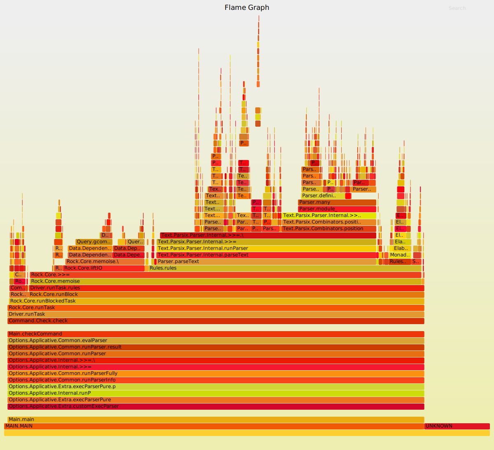
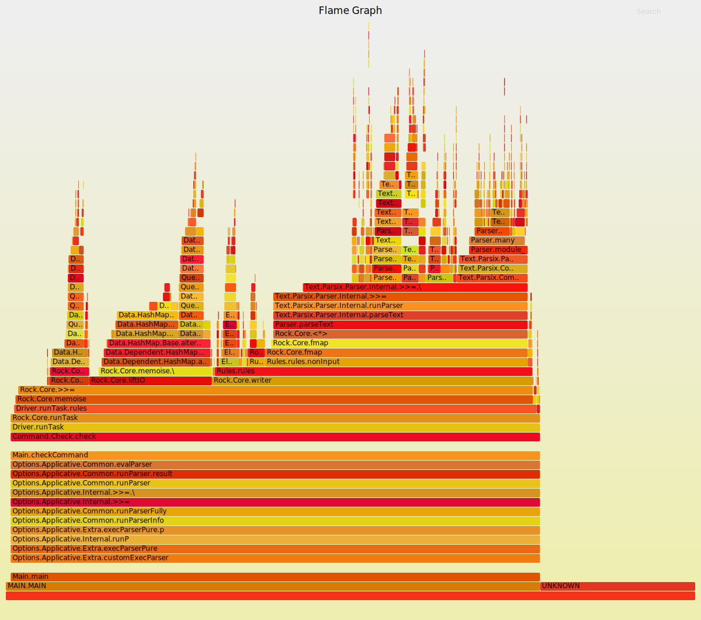

## Background

I'm working on a reimplementation of [Sixten](https://github.com/ollef/sixten),
a dependently typed programming language that supports unboxed data. The
reimplementation currently lives in a separate repository, and is called
[Sixty](https://github.com/ollef/sixty), though the intention is that it going
to replace Sixten eventually.  The main reason for doing a reimplementation is
to try out some implementation techniques to make the type checker faster,
inspired by András Kovács' [smalltt](https://github.com/AndrasKovacs/smalltt).

In this post I'm going to show some optimisations that I implemented recently. I
will also show the workflow and profiling tools that I use to find _what_ to
optimise in Haskell programs such as Sixty.

## A benchmark

What set me off was that I was curious to see how Sixty would handle programs
with many modules.  The problem was that no one had ever written any large
programs in the language so far.

As a substitute, I added a command to generate nonsense programs of a given
size. The programs that I used for the benchmarks in this post consist of just over
10 000 lines divided into 100 modules that all look like this:

```haskell
module Module60 exposing (..)

import Module9
import Module24
import Module35
import Module16
import Module46
import Module37
import Module50
import Module47
import Module46
import Module3

f1 : Type
f1 = Module46.f10 -> Module46.f20

f2 : Type
f2 = Module50.f24 -> Module47.f13

[...]

f30 : Type
f30 = Module37.f4 -> Module24.f24
```

Each module is about 100 lines of code, of which a third or so are newlines,
and has thirty definitions that refer to definitions from other modules.  The
definitions are simple enough to be type checked very quickly, so the benchmark
makes us focus mostly on other parts of the compiler.

I'd also like to write about the type checker itself, but will save that for
another post.

## Profiling

I use three main tools to try to identify bottlenecks and other things to improve:

* [bench](http://www.haskellforall.com/2016/05/a-command-line-benchmark-tool.html)
    is a replacement for the Unix `time` command that I use to get more
    reliable timings, especially useful for comparing the before and
    after time of some change.
* GHC's built-in profiling support, which gives us a detailed breakdown of where
  time is spent when running the program.

  When using Stack, we can build with profiling by issuing:

  ```sh
  stack install --profile
  ```

  Then we can run the program with profiling enabled:

  ```sh
  sixty check +RTS -p
  ```

  This produces a file `sixty.prof` that contains the profiling information.

  I also really like to use [ghc-prof-flamegraph](https://github.com/fpco/ghc-prof-flamegraph) to turn the profiling output into a flamegraph:

  ```sh
  ghc-prof-flamegraph sixty.prof
  ```

* [Threadscope](https://wiki.haskell.org/ThreadScope) is a visual tool for debugging
    the parallelism in a Haskell program. It also shows when the garbage collector runs,
    so can be used when tuning garbage collector parameters.

## Baseline and initial profiling

The baseline time used in this post starts on [this
commit](https://github.com/ollef/sixty/tree/29094e006d4c88f51d744b0fd26f3e2e18af3ce0).

At this point we get the following time to run `sixty check` in the 100 module project on my machine:

|          | Time    |
|----------|--------:|
| Baseline | 1.30 s  |

The flamegraph of the profiling output looks like this:

[](../images/speeding-up-sixty/0-29094e006d4c88f51d744b0fd26f3e2e18af3ce0.svg)

Two things stick out to me in the flamegraph:

* Parsing takes about 45 % of the time.
* Operations on [`Data.Dependent.Map`](https://hackage.haskell.org/package/dependent-map) take about 15 % of the time, and a large part of that is calls to `Query.gcompare` when the map is doing key comparisons during lookups and insertions.

Here's what a run looks like in ThreadScope:

[](../images/speeding-up-sixty/0-29094e006d4c88f51d744b0fd26f3e2e18af3ce0-threadscope.png)

And here's a more zoomed in ThreadScope picture:

[](../images/speeding-up-sixty/0-29094e006d4c88f51d744b0fd26f3e2e18af3ce0-threadscope-detail.png)

I note the following in the ThreadScope output:

* One core is doing almost all of the work, with other cores only occasionally performing very short tasks.
* Garbage collection runs extremely often and takes just over 20 % of the time.

## Optimisation 1: Better RTS flags

As we saw in the ThreadScope output, garbage collection runs often and takes a
large part of the total runtime of the type checker.

In [this
commit](https://github.com/ollef/sixty/tree/f8d4ee7ee0d3d617c6d30401592f5639be60b14a)
I most notably introduce the RTS option `-A50m`,
which sets the default allocation area size used by the garbage collector to
50 MB, instead of the default 1 MB, which means that GC can run less often,
potentially at the cost of worse cache behaviour and memory use.  The value
`50m` was found to be the sweet spot for performance on my machine by trying
some different values.

The result of this change is this:

|           | Time    | Delta |
|-----------|--------:|------:|
| Baseline  | 1.30 s  |       |
| RTS flags | 1.08 s  | -17 % |

The ThreadScope output shows that the change has a very noticeable
effect of decreasing the number of garbage collections:

[](../images/speeding-up-sixty/1-f8d4ee7ee0d3d617c6d30401592f5639be60b14a-threadscope.png)

Also note that the proportion of time used by the GC went from 20 % to 3 %,
which seems good to me.

## Optimisation 2: A couple of Rock library improvements

[Rock](https://github.com/ollef/rock) is a library that's used to implement
query-based compilation in Sixty. I made two improvements to it that made Sixty
almost twice as fast at the task:

|           | Time    | Delta |
|-----------|--------:|------:|
| Baseline  | 1.30 s  |       |
| RTS flags | 1.08 s  | -17 % |
| Rock      | 0.613 s | -43 % |

The changes are:

* Using `IORef`s and atomic operations instead of `MVar`s:
  Rock uses a cache e.g. to keep track of what queries have already been executed.
  This cache is potentially accessed and updated from different threads.
  Before this change this state was stored in an `MVar`, but since it's only
  doing fairly simple updates, the atomic operations of
  `IORef` are sufficient.
* Being a bit more clever about the automatic parallelisation:
  We'll get back to this, but at this point in time Rock uses a
  [Haxl](https://github.com/facebook/Haxl)-like automatic parallelisation scheme, running
  queries done in an `Applicative` context in parallel.
  The change here is to only trigger parallel query execution if both queries
  are not already cached.  Before this change even the cache lookup part of the
  queries was done in parallel, which is likely far too fine-grained to pay
  off.

[comment]: <> ([](../images/speeding-up-sixty/1-f8d4ee7ee0d3d617c6d30401592f5639be60b14a.svg))

We can see quite clearly in ThreadScope that the parallelisation has a seemingly good effect
for part of the runtime, but not all of it:

[](../images/speeding-up-sixty/2-54b87689f345173dbed3510a396641cd8c5e43f2-threadscope.png)

Sadly I didn't update Sixty in between the two changes, so I don't really know
how much each one contributes.

## Optimisation 3: Manual query parallelisation

I wasn't quite happy with the automatic parallelism since it mostly resulted in
sequential execution. To improve on that, I removed the automatic parallelism
support from the Rock library, and started doing it manually instead.

Code wise [this change is quite
small](https://github.com/ollef/sixty/commit/7ca773e347dae952d4c7249a0310f10077a2474b).
It's going from

```haskell
checkAll = do
  inputFiles <- fetch Query.InputFiles
  forM_ inputFiles checkFile
```

to

```haskell
checkAll = do
  inputFiles <- fetch Query.InputFiles
  pooledForConcurrently_ inputFiles checkFile
```

where `pooledForConcurrently_` is a variant of `forM_` that runs in parallel,
using pooling to keep the number of threads the same as the number of cores on
the machine it's run on.

Here are the timings:

|                          | Time    | Delta |
|--------------------------|--------:|------:|
| Baseline                 | 1.30 s  |       |
| RTS flags                | 1.08 s  | -17 % |
| Rock                     | 0.613 s | -43 % |
| Manual parallelisation   | 0.451 s | -26 % |

Being able to do type check modules in parallel on a whim this seems to be a
great advantage of using a query-based architecture.  The modules can be
processed in any order, and any non-processed dependencies that are missing are
processed and cached on an as-needed basis.

ThreadScope shows that the CPU core utilisation is improved, even
though the timings aren't as much better as one might expect from the image:

[](../images/speeding-up-sixty/4-7ca773e347dae952d4c7249a0310f10077a2474b-threadscope.png)

The flamegraph is also interesting, because the proportion of time
that goes to parsing has gone down to about 17 % without having made any
changes to the parser, which can be seen in the top-right part of the image:

[](../images/speeding-up-sixty/4-7ca773e347dae952d4c7249a0310f10077a2474b.svg)

This might indicate that that part of the compiler parallelises well.

## Optimisation 4: Parser lookahead

Here's an experiment that only helped a little. As we just saw, parsing still
takes quite a large proportion of the total time spent, almost 17~%, so I
wanted to make it faster.

The parser is written using parsing combinators, and the "inner loop" of e.g.
the term parser is a choice between a bunch of different alternatives. Something like this:

```haskell
term :: Parser Term
term =
  parenthesizedTerm    -- (t)
  <|> letExpression    -- let x = t in t
  <|> caseExpression   -- case t of branches
  <|> lambdaExpression -- \x. t
  <|> forallExpression -- forall x. t
  <|> var              -- x
```

These alternatives are tried in order, which means that to reach
e.g. the `forall` case, the parser will try to parse the first token of
each of the four preceding alternatives.

But note that the first character of each alternative rules out all other
cases, save for (sometimes) the `var` case.

So the idea here is to rewrite the parser like this:

```haskell
term :: Parser Term
term = do
  firstChar <- lookAhead anyChar
  case firstChar of
    '(' ->
      parenthesizedTerm

    'l' ->
      letExpression
      <|> var

    'c' ->
      caseExpression
      <|> var

    '\\' ->
      lambdaExpression

    'f' ->
      forallExpression
      <|> var

    _ ->
      var
```

Now we just have to look at the first character to rule out the first four
alternatives when parsing a `forall`.

Here are the results:

|                          | Time    | Delta |
|--------------------------|--------:|------:|
| Baseline                 | 1.30 s  |       |
| RTS flags                | 1.08 s  | -17 % |
| Rock                     | 0.613 s | -43 % |
| Manual parallelisation   | 0.451 s | -26 % |
| Parser lookahead         | 0.442 s |  -2 % |

Not great, but it's something.

## Optimisation 5: Dependent hashmap

At this point, around 68 % of the time goes to operations on
[`Data.Dependent.Map`](https://hackage.haskell.org/package/dependent-map):

[](../images/speeding-up-sixty/5-8ea6700415f1c46fb300571382ef438ae6082e8e.svg)

Note that this was 15 % when we started out, so it has become the bottleneck
only because we've fixed several others.

`Data.Dependent.Map` implements a kind of dictionary data structure that allows
the type of values depend on the key, which is crucial for caching the result
of queries, since each query may return a different type.

`Data.Dependent.Map` is implemented as a clone of `Data.Map` from the
`containers` package, adding this key-value dependency, so it's
a binary tree that uses comparisons on the key type when doing
insertions and lookups.

In the flamegraph above we can also see that around 21 % of the time goes to
comparing the `Query` type. The reason for this slowness is likely that queries often
contain strings, because most are things like "get the type of [name]".
Strings are slow to compare because you need to traverse at least part of
the string for each comparison.

It would be a better idea to use a hash map, because then the string usually
only has to be traversed once, to compute the hash, but the problem is that
there is no _dependent_ hash map library in Haskell. Until now that is. I
implemented a [dependent version of the standard
`Data.HashMap`](https://github.com/ollef/dependent-hashmap) type from the
`unordered-containers` as a thin wrapper around it.
The results are as follows:

|                          | Time    | Delta |
|--------------------------|--------:|------:|
| Baseline                 | 1.30 s  |       |
| RTS flags                | 1.08 s  | -17 % |
| Rock                     | 0.613 s | -43 % |
| Manual parallelisation   | 0.451 s | -26 % |
| Parser lookahead         | 0.442 s |  -2 % |
| Dependent hashmap        | 0.257 s | -42 % |

Having a look at the flamegraph after this change, we can see that `HashMap`
operations take about 20 % of the total run time which is a lot better than
68 % even though there's still room for improvement.
We can also see that the main bottleneck is now the parser:

[](../images/speeding-up-sixty/6-722533c5d71871ca1aa6235fe79a53f33da99c36.svg)

## Optimisation 6: `ReaderT`-based Rock library

Here's one that wasn't obvious from the profiling that I did by ear.

I mentioned that the Rock library used to support automatic parallelisation,
but that I switched to doing it manually. A remnant from that was that the
`Task` type in Rock was implemented in a needlessly inefficient way. `Task` is
a monad that allows fetching queries, which the whole Sixty compiler is written
in.

Before this change, `Task` was implemented roughly as follows:

```haskell
newtype Task query a = Task { unTask :: IO (Result query a) }

data Result query a where
  Done :: a -> Result query a
  Fetch :: query a -> (a -> Task query b) -> Result query b
```

So to make a `Task` that fetches a query `q`, you need to create an `IO` action
that returns a `Fetch q pure`. When doing automatic parallelisation, this allows
introspecting whether a `Task` wants to do a fetch, such that independent fetches
can be identified and run in parallel.

But actually, since we no longer support automatic parallelisation, this type might
as well be implemented like this:

```haskell
newtype Task query a = Task { unTask :: ReaderT (Fetch query) IO a }

newtype Fetch query = Fetch (forall a. query a -> IO a)
```

The `ReaderT`-based implementation turns out to be a bit faster:

|                          | Time    | Delta |
|--------------------------|--------:|------:|
| Baseline                 | 1.30 s  |       |
| RTS flags                | 1.08 s  | -17 % |
| Rock                     | 0.613 s | -43 % |
| Manual parallelisation   | 0.451 s | -26 % |
| Parser lookahead         | 0.442 s |  -2 % |
| Dependent hashmap        | 0.257 s | -42 % |
| `ReaderT` in Rock        | 0.245 s |  -5 % |

## Optimisation 7: Separate lexer

Let's have a look at the flamegraph at this point in time:
[](../images/speeding-up-sixty/7-048d2cec50e9994a0b159a2383580e3df5dd2a7e.svg)

The parser now takes almost 30 % of the total run time.
The parser is written using parser combinators that work directly on characters, so
it's also doing tokenisation on the fly.

I've been wondering about the performance impact of this practice, since it's
quite common in the Haskell world.  So the change I made
[here](https://github.com/ollef/sixty/commit/11c46c5b03f26a66347d5f387bd4cdfd5f6de4a2)
is to write a faster lexer that's separate from the parser, and then make the
parser work on the list of tokens that the lexer spits out.

This turned out to be a great idea:

|                          | Time    | Delta |
|--------------------------|--------:|------:|
| Baseline                 | 1.30 s  |       |
| RTS flags                | 1.08 s  | -17 % |
| Rock                     | 0.613 s | -43 % |
| Manual parallelisation   | 0.451 s | -26 % |
| Parser lookahead         | 0.442 s |  -2 % |
| Dependent hashmap        | 0.257 s | -42 % |
| `ReaderT` in Rock        | 0.245 s |  -5 % |
| Separate lexer           | 0.154 s | -37 % |

The "inner loop" of the parser that I tried optimising in the "Parser
lookahead" step has now become a case expression on the next token, visible
[here](https://github.com/ollef/sixty/blob/11c46c5b03f26a66347d5f387bd4cdfd5f6de4a2/src/Parser.hs#L543-L581).


## Optimisation 8: Faster hashing

The flamegraph at this point contains mostly things I don't really know what
to do with, but there's one thing left, and that's hashing of queries, which
now takes just short of 18 % of the total runtime:
[](../images/speeding-up-sixty/8-11c46c5b03f26a66347d5f387bd4cdfd5f6de4a2.svg)

The change I made
[here](https://github.com/ollef/sixty/commit/d5bad6f606450d0a2c8926072e7b4845d982b81f)
is to write some `Hashable` instances by hand instead of deriving them, and to
add some inlining pragmas. This gives a 5 % speedup:

|                          | Time    | Delta |
|--------------------------|--------:|------:|
| Baseline                 | 1.30 s  |       |
| RTS flags                | 1.08 s  | -17 % |
| Rock                     | 0.613 s | -43 % |
| Manual parallelisation   | 0.451 s | -26 % |
| Parser lookahead         | 0.442 s |  -2 % |
| Dependent hashmap        | 0.257 s | -42 % |
| `ReaderT` in Rock        | 0.245 s |  -5 % |
| Separate lexer           | 0.154 s | -37 % |
| Faster hashing           | 0.146 s |  -5 % |

The new flamegraph shows that query hashing is now down to around 11 % of the time.
[](../images/speeding-up-sixty/9-d5bad6f606450d0a2c8926072e7b4845d982b81f.svg)

## Conclusion

I was able to make the Sixty compiler nine times faster for this benchmark.
This was made possible by the excellent profiling tools that we have for Haskell.
There's no reason to be optimising in the dark here.

As a reminder, here's what the compiler looked like in ThreadScope to start with:

[](../images/speeding-up-sixty/0-29094e006d4c88f51d744b0fd26f3e2e18af3ce0-threadscope.png)

Here's where we're at now:

[](../images/speeding-up-sixty/9-d5bad6f606450d0a2c8926072e7b4845d982b81f-threadscope.png)

It looks faster and it _is_ faster.
